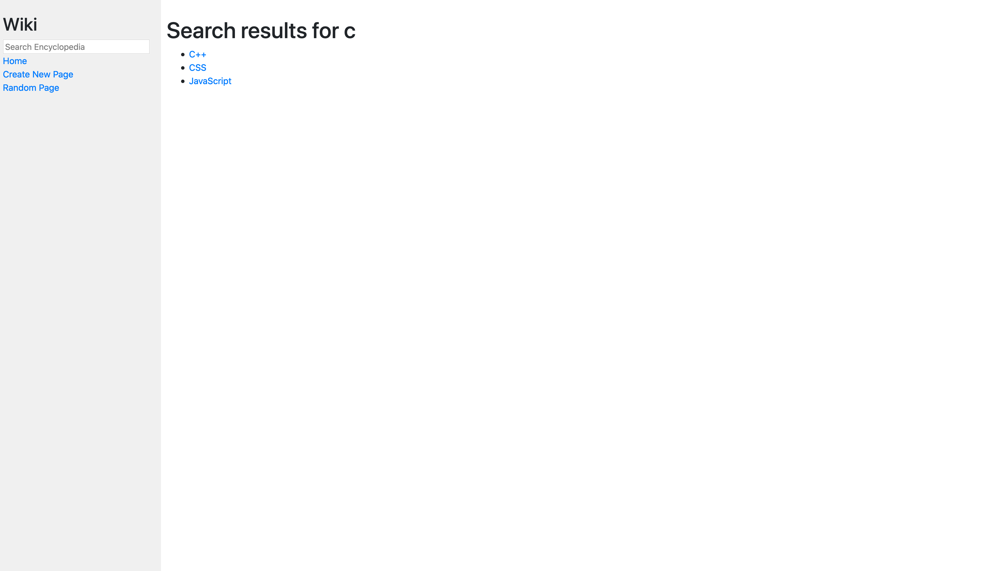

# Project Wiki

This is the first project for CS50w on edX, mostly for familiarizing myself with Django and front-end web development.

[Project website](https://cs50.harvard.edu/web/2020/projects/1/wiki/)

# Description

The website had the following functionality:

* *index.html* having links to all the entries.
* creating new pages
* viewing existing pages and editing them
* searching through thr existing pages either by exact matches or by substrings
* visiting random pages

Screenshots:

Built with:

* Django
* Python
* HTML
* CSS
* [python-markdown2](https://github.com/trentm/python-markdown2)

Author - Kunal Arora
